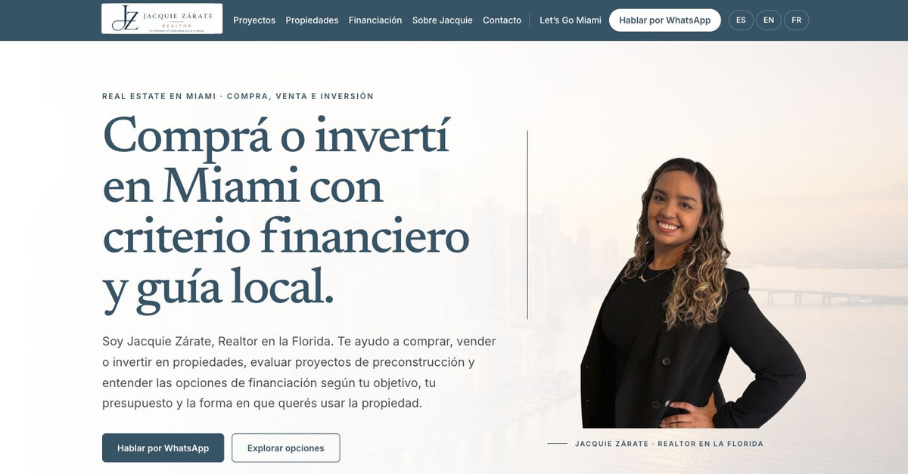
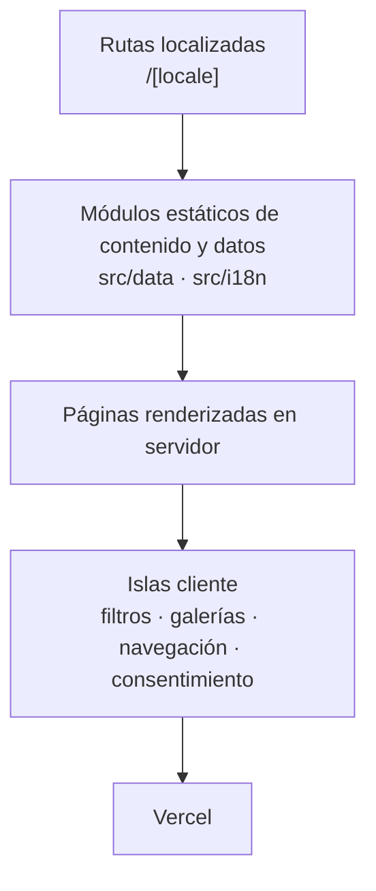
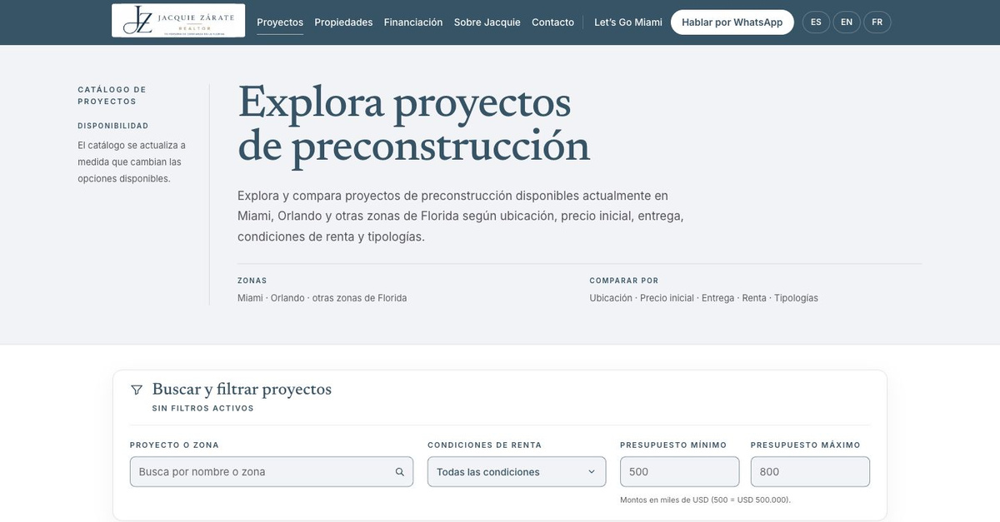
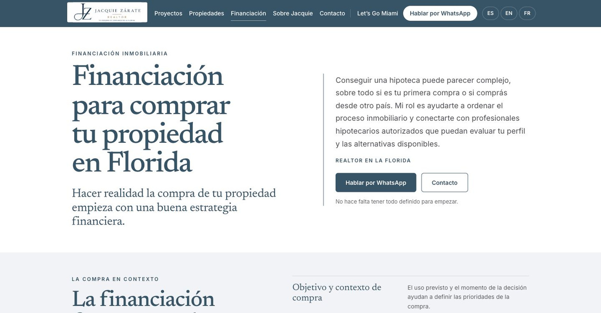
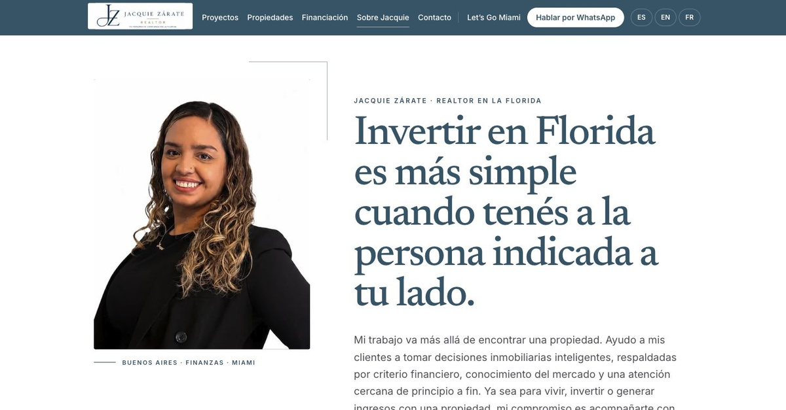

[English](README.md) · [Español](README.es.md)

# Jacquie Zárate — Sitio inmobiliario trilingüe

Sitio inmobiliario trilingüe para comprar, vender e invertir en Miami, con catálogo de preconstrucción filtrable, fichas de propiedades, orientación financiera y contacto directo por WhatsApp y email.

**[Ver sitio](https://jacquiezarate.com)** · **[English](README.md)**



---

## Descripción

Este es el sitio público de **Jacquie Zárate**, Realtor en la Florida asociada a Miami Life Realty. Está dirigido a compradores, vendedores e inversores, con foco comercial en Miami y otras zonas de Florida.

El sitio se publica en tres idiomas — español, inglés y francés (Canadá) — bajo rutas localizadas, con contenido editorial escrito por idioma y no traducido automáticamente en tiempo de ejecución.

Dirección de producto, UX/UI y desarrollo end-to-end por **Rodrigo Opalo**. La arquitectura es estática y modular: el contenido vive en módulos TypeScript tipados, las páginas se renderizan en el servidor y solo se envían como islas cliente las partes que realmente necesitan interactividad. Producción en Vercel.

El logo, las fotografías, la información inmobiliaria, los materiales de los desarrolladores y la identidad del brokerage pertenecen a sus respectivos titulares y no son autoría de Rodrigo Opalo.

---

## Enfoque de producto

El sitio no se diseñó como un marketplace inmobiliario genérico.

La jerarquía prioriza claridad, confianza y conversación. El CTA principal en todo el sitio es WhatsApp, porque una decisión inmobiliaria de este tipo empieza como una conversación y no como un checkout. La exploración del catálogo es secundaria y está al servicio de esa conversación: existe para que quien llega al chat ya sepa qué quiere preguntar.

El alcance siguió la misma lógica. Se evaluaron y se dejaron fuera un CMS, un panel de administración y una base de datos, porque el contenido cambia a un ritmo que el código y el deployment ya resuelven bien. Mantener los datos en módulos tipados permitió que todo el sitio fuera renderizable de forma estática, redujo la superficie del producto y mantuvo la voz editorial bajo revisión directa.

---

## Funcionalidades

**Idiomas y rutas**

- Tres idiomas: español, inglés y francés (Canadá)
- Rutas localizadas bajo `/[locale]`
- Selector de idioma con preferencia persistida

**Catálogo de preconstrucción**

- Catálogo de proyectos filtrable
- Búsqueda insensible a acentos sobre nombre de proyecto y ciudad
- Filtros por presupuesto mínimo y máximo, con validación en línea de rangos invertidos
- Filtros por política de renta
- Ordenamiento por nombre y por precio inicial
- Carga progresiva con control de "ver más"
- Chips de filtros activos que se pueden quitar individualmente

**Fichas de proyecto**

- Galería de imágenes con lightbox
- Tipologías de unidades
- Planes de pago
- FAQs del proyecto
- Ubicación, con mapa embebido
- Controles para compartir

**Propiedades**

- Catálogo y fichas individuales de propiedades
- Galería con lightbox, especificaciones y ubicación
- CTA directo de WhatsApp por propiedad

**Contenido y contacto**

- Página editorial de financiación para compradores internacionales
- Página Sobre Jacquie
- Contacto por WhatsApp y email
- Sub-marca **Let's Go Miami** con identidad visual, header y footer propios
- Control de consentimiento de analytics y página de privacidad trilingüe

---

## Internacionalización

La localización se resuelve con **next-intl**.

- Locales soportados: `es`, `en`, `fr`
- `fr` se renderiza como **`fr-CA`** — el atributo `<html lang>`, los alternates `hreflang`, el locale de Open Graph y el formato de números y moneda usan `fr-CA`
- Locale por defecto: **español**, usado como fallback cuando no se resuelve ninguna preferencia válida
- La detección inicial se basa en el `Accept-Language` del navegador
- Una elección explícita de idioma se persiste en una cookie `NEXT_LOCALE` con path `/`, para que sobreviva a la navegación por todo el sitio
- Solo una navegación de nivel superior deliberada puede persistir una preferencia — el middleware elimina la cookie de locale en las peticiones del router cliente, para que el prefetch de enlaces de Next.js no sobrescriba silenciosamente la elección de la persona que visita el sitio
- El contenido editorial está localizado por página y no generado en tiempo de ejecución, con overlays en francés dedicados para los datos de proyectos y propiedades

---

## SEO

- Metadata localizada por página y por idioma
- URL canónica por página localizada
- Alternates `hreflang` para `es`, `en` y `fr-CA`
- `x-default` apuntando a la versión en español
- Sitemap dinámico generado a partir de los módulos de datos de proyectos y propiedades, con alternates localizados para cada entrada
- Ruta `robots` que permite el sitio y bloquea `/api/`
- Etiquetas Open Graph, incluyendo locale y locales alternativos
- Twitter Cards (`summary_large_image`)
- Set de favicon, Apple touch icon y manifest de aplicación web

**El JSON-LD está presente únicamente donde realmente está implementado:** las fichas individuales de propiedades emiten un bloque de datos estructurados `Residence`. El sitio no declara datos estructurados en todas las rutas.

---

## Accesibilidad

Trabajo de accesibilidad realizado — esto describe la implementación, no es una certificación:

- Etiquetado ARIA en navegación, controles del catálogo, paneles de filtros y secciones de contenido
- Navegación por teclado, incluyendo focus trap y manejo de `Escape` en el menú móvil
- Focus management: el foco vuelve al botón del menú al cerrarlo, y se mueve al título del catálogo después de resetear o limpiar filtros
- Targets táctiles dimensionados para un toque cómodo en los controles interactivos
- `prefers-reduced-motion` respetado en transiciones y elementos animados
- Mensajes accesibles de estado y error mediante `role="status"`, `role="alert"` y live regions
- El aviso de consentimiento de analytics es una región etiquetada y alcanzable por teclado, que mueve el foco a su primera acción cuando se reabre desde configuración

---

## Arquitectura

- **Next.js App Router** con segmentos de ruta localizados bajo `src/app/[locale]`
- **Server Components** por defecto; el layout de locale se renderiza de forma estática para los tres idiomas
- **Islas cliente** solo donde la interacción lo requiere: filtros del catálogo, galerías y lightboxes, navegación y aviso de consentimiento
- **El contenido y los datos viven en módulos TypeScript estáticos** bajo `src/data`, tipados e importados en tiempo de build
- **Sin base de datos, sin CMS, sin panel administrativo, sin integración MLS**
- Existe un **endpoint de contacto latente**: `src/app/api/contact` está conectado a un transporte de email que solo se activa cuando sus variables de entorno están configuradas. No está activo en el producto en producción, y el formulario de contacto no se renderiza cuando el transporte no está configurado
- Desplegado en **Vercel**



---

## Stack técnico

Versiones según lo declarado en [`package.json`](package.json):

| Capa | Tecnología |
|---|---|
| Framework | Next.js `15.5.7` (App Router) |
| Runtime de UI | React `19.1.0` |
| Lenguaje | TypeScript `^5` (`strict: true`) |
| Estilos | Tailwind CSS `^4` |
| Internacionalización | next-intl `^4.3.5` |
| Primitivas de UI | Radix UI (`accordion`, `dialog`, `slot`, `tabs`) vía shadcn/ui (estilo `new-york`) |
| Iconos | lucide-react, @heroicons/react |
| Motion | framer-motion `^12.23.12` |
| Formularios y validación | react-hook-form `^7.75.0`, zod `^4.1.5`, libphonenumber-js `^1.13.1` — infraestructura latente para el endpoint de contacto inactivo |
| Transporte de email | resend `^6.12.3` — latente, se activa solo por entorno |
| Imágenes | `next/image`; assets alojados en ImageKit para la galería de Let's Go Miami, más un loader opcional de ImageKit |
| Hosting | Vercel |
| CI | GitHub Actions |
| Actualización de dependencias | Dependabot (semanal, majors ignorados) |

---

## Estructura del proyecto

```
src/
  app/
    [locale]/          Rutas localizadas: home, proyectos, listings,
                       financiacion, sobre-mi, contacto,
                       lets-go-miami, privacidad, gracias
    api/contact/       Endpoint de contacto latente
    robots.ts          Ruta de robots
    sitemap.ts         Sitemap dinámico
  components/          Secciones compartidas e islas cliente
    ui/                Primitivas shadcn/Radix
  data/                Proyectos, propiedades, overlays en francés, tipos
  i18n/                Configuración de routing y catálogos de mensajes
  lib/                 SEO, analytics, WhatsApp, contacto, Let's Go Miami
  utils/               Loaders y helpers puntuales
  types/               Declaraciones de tipos ambientales
public/                Assets estáticos, iconos, manifest
tests/                 Suites de node:test
.github/workflows/     CI
middleware.ts          Middleware de locale
```

### Rutas

| Ruta | Descripción |
|---|---|
| `/[locale]` | Home |
| `/[locale]/proyectos` | Catálogo de preconstrucción |
| `/[locale]/proyectos/[slug]` | Ficha de proyecto |
| `/[locale]/listings` | Catálogo de propiedades |
| `/[locale]/listings/[slug]` | Ficha de propiedad |
| `/[locale]/financiacion` | Financiación |
| `/[locale]/sobre-mi` | Sobre Jacquie |
| `/[locale]/contacto` | Contacto |
| `/[locale]/lets-go-miami` | Sub-marca Let's Go Miami |
| `/[locale]/privacidad` | Política de privacidad y analítica |
| `/[locale]/gracias` | Página de confirmación |

`/[locale]/precon`, `/[locale]/miami` y `/[locale]/storages` son rutas heredadas mantenidas como redirects. `/[locale]/property-management` fue retirada y responde 404.

---

## Desarrollo local

```bash
npm install
```

```bash
npm run dev
```

```bash
npm run build
```

```bash
npm run lint
```

```bash
npm run test:analytics
```

`npm run test:analytics` es el script de tests declarado en `package.json`; ejecuta la suite de analytics con `node:test`. Existen suites adicionales de `node:test` en `tests/` que hoy no están conectadas a un script de npm.

---

## Variables de entorno

No hace falta ninguna variable de entorno para instalar, ejecutar ni construir el sitio localmente. No se necesita una API key para navegar el sitio en tu máquina.

**Opcionales**

| Variable | Efecto si no está definida |
|---|---|
| `NEXT_PUBLIC_GA_MEASUREMENT_ID` | Google Analytics 4 no se inicializa y el aviso de consentimiento no se muestra. Cuando está definida, GA4 igualmente se carga solo después de que la persona acepta explícitamente. |
| `NEXT_PUBLIC_IMAGEKIT_BASE_URL` | Solo necesaria si se usa el loader de ImageKit con paths de imagen relativos. Las URLs absolutas de ImageKit ya presentes en los módulos de datos funcionan sin ella. |

**Integración deshabilitada — el endpoint de contacto**

El transporte de email detrás de `src/app/api/contact` permanece inactivo salvo que todo lo siguiente resuelva una configuración válida: `CONTACT_PROVIDER`, `RESEND_API_KEY`, `CONTACT_FROM_EMAIL` y `CONTACT_TO` (o `LEADS_TO`); `CONTACT_FROM_NAME` es opcional.

El sitio puede ejecutarse sin Resend. El formulario de contacto productivo está deshabilitado, y el contacto ocurre por WhatsApp y email directo. En este repositorio no se publica ningún valor, y este documento no afirma nada sobre el estado actual de las variables privadas en Vercel.

---

## Deployment

- Código alojado en GitHub
- Desplegado en **Vercel** desde la rama `main`
- Dominio productivo: **[jacquiezarate.com](https://jacquiezarate.com)**
- CI corre en pull requests y en pushes a `main`: la suite de tests de analytics y un build de producción

En este repositorio no se publican identificadores internos de proyecto, deployment hooks ni datos de cuenta.

---

## Límites de alcance

Estas son decisiones de alcance, no carencias:

- Sin CMS
- Sin panel administrativo
- Sin base de datos
- Sin feed MLS
- Sin CRM
- Sin ecommerce
- Sin autenticación

Los datos inmobiliarios se actualizan mediante código y deployment. Para un catálogo de este tamaño y esta cadencia, eso mantiene el sitio completamente estático, deja el contenido bajo revisión editorial directa y elimina del producto toda una categoría de infraestructura.

---

## Créditos

- **Dirección de producto, UX/UI y desarrollo:** Rodrigo Opalo
- **Negocio inmobiliario, aprobación de contenido e información de proyectos:** Jacquie Zárate
- **Brokerage:** Miami Life Realty
- **Las imágenes de desarrollos y propiedades** pertenecen a sus respectivos titulares y proveedores
- **Let's Go Miami** es operado por Jacna Services LLC

---

## Capturas

**Catálogo de preconstrucción**



**Financiación**



**Sobre Jacquie**



---

## Estado

**Live** y con mantenimiento activo.

URL de producción: **[https://jacquiezarate.com](https://jacquiezarate.com)**
