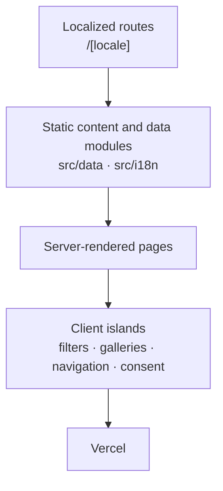

[English](README.md) · [Español](README.es.md)

# Jacquie Zárate — Trilingual Real Estate Website

A trilingual real estate website for buying, selling, and investing in Miami, with a filterable pre-construction catalog, property pages, financing guidance, and direct contact through WhatsApp and email.

**[Live website](https://jacquiezarate.com)** · **[Español](README.es.md)**


---

## Overview

This is the public website of **Jacquie Zárate**, a Realtor in Florida affiliated with Miami Life Realty. It serves buyers, sellers, and investors, with a commercial focus on Miami and other areas of Florida.

The site ships in three languages — Spanish, English, and French (Canada) — under localized routes, with the editorial content written per locale rather than machine-translated at runtime.

Product direction, UX/UI, and end-to-end development by **Rodrigo Opalo**. The architecture is static and modular: content lives in typed TypeScript modules, pages render on the server, and only the parts that genuinely need interactivity ship as client islands. Production runs on Vercel.

The logo, photography, real estate information, developer materials, and the brokerage identity belong to their respective owners and are not authored by Rodrigo Opalo.

---

## Product approach

The site was deliberately not built as a generic property marketplace.

The hierarchy prioritizes clarity, trust, and conversation. The primary call to action across the site is WhatsApp, because a real estate decision at this level starts as a conversation rather than a checkout. Catalog exploration is secondary and supports that conversation: it exists so a visitor can arrive at the chat already knowing what they want to ask about.

Scope followed the same logic. A CMS, an admin panel, and a database were considered and left out, because the content changes at a rhythm that code and deployment already handle well. Keeping the data in typed modules made the whole site statically renderable, kept the surface area small, and kept the editorial voice under direct review.

---

## Key features

**Languages and routing**

- Three languages: Spanish, English, and French (Canada)
- Localized routes under `/[locale]`
- Language switcher with a persisted preference

**Pre-construction catalog**

- Filterable project catalog
- Accent-insensitive search across project name and city
- Minimum and maximum budget filters, with inline validation of inverted ranges
- Rental policy filters
- Sorting by name and by starting price
- Progressive loading with a "show more" control
- Active-filter chips that can be cleared individually

**Project pages**

- Image gallery with a lightbox
- Unit typologies
- Payment plans
- Project FAQs
- Location, with an embedded map
- Share controls

**Properties**

- Property catalog and individual property pages
- Gallery with lightbox, specifications, and location
- Direct WhatsApp CTA per property

**Content and contact**

- Editorial financing page for international buyers
- About page
- Contact through WhatsApp and email
- **Let's Go Miami** sub-brand with its own visual identity, header, and footer
- Analytics consent control and a trilingual privacy page

---

## Internationalization

Localization is handled with **next-intl**.

- Supported locales: `es`, `en`, `fr`
- `fr` is rendered as **`fr-CA`** — the `<html lang>` attribute, the `hreflang` alternates, the Open Graph locale, and number/currency formatting all use `fr-CA`
- Default locale: **Spanish**, used as the fallback whenever no valid preference resolves
- Initial detection is based on the visitor's browser `Accept-Language`
- An explicit language choice is persisted in a `NEXT_LOCALE` cookie scoped to `/`, so it survives navigation across the site
- Only a deliberate top-level navigation may persist a preference — the middleware strips the locale cookie from client-router requests so that Next.js link prefetching cannot silently overwrite the visitor's choice
- Editorial content is localized per page rather than generated at runtime, with dedicated French overlays for project and listing data

---

## SEO

- Localized metadata per page and per locale
- Canonical URL per localized page
- `hreflang` alternates for `es`, `en`, and `fr-CA`
- `x-default` pointing to the Spanish version
- Dynamic sitemap generated from the project and listing data modules, including localized alternates for every entry
- `robots` route that allows the site and disallows `/api/`
- Open Graph tags, including locale and alternate locales
- Twitter Cards (`summary_large_image`)
- Favicon set, Apple touch icon, and a web app manifest

**JSON-LD is present only where it is actually implemented:** individual property pages emit a `Residence` structured-data block. The site does not claim structured data across all routes.

---

## Accessibility

Accessibility work that was done — this is a description of the implementation, not a certification:

- ARIA labelling on navigation, catalog controls, filter panels, and content sections
- Keyboard navigation, including a focus trap and `Escape` handling in the mobile menu
- Focus management: focus is restored to the menu trigger on close, and moved to the catalog heading after filters are reset or cleared
- Touch targets sized for comfortable tapping on the interactive controls
- `prefers-reduced-motion` respected across transitions and animated elements
- Accessible status and error messaging through `role="status"`, `role="alert"`, and live regions
- The analytics consent notice is a labelled, keyboard-reachable region that moves focus to its first action when reopened from settings

---

## Architecture

- **Next.js App Router** with localized route segments under `src/app/[locale]`
- **Server Components** by default; the locale layout is statically rendered for all three locales
- **Client islands** only where interaction requires them: catalog filters, galleries and lightboxes, navigation, and the consent notice
- **Content and data live in static TypeScript modules** under `src/data`, typed and imported at build time
- **No database, no CMS, no admin panel, no MLS integration**
- A **contact endpoint exists but is latent**: `src/app/api/contact` is wired to an email transport that only activates when its environment variables are configured. It is not active in the production product, and the contact form is not rendered when the transport is unconfigured
- Deployed on **Vercel**



---

## Tech stack

Versions as declared in [`package.json`](package.json):

| Layer | Technology |
|---|---|
| Framework | Next.js `15.5.7` (App Router) |
| UI runtime | React `19.1.0` |
| Language | TypeScript `^5` (`strict: true`) |
| Styling | Tailwind CSS `^4` |
| Internationalization | next-intl `^4.3.5` |
| UI primitives | Radix UI (`accordion`, `dialog`, `slot`, `tabs`) via shadcn/ui (`new-york` style) |
| Icons | lucide-react, @heroicons/react |
| Motion | framer-motion `^12.23.12` |
| Forms and validation | react-hook-form `^7.75.0`, zod `^4.1.5`, libphonenumber-js `^1.13.1` — latent infrastructure for the inactive contact endpoint |
| Email transport | resend `^6.12.3` — latent, activated by environment only |
| Images | `next/image`; ImageKit-hosted assets for the Let's Go Miami gallery, plus an optional ImageKit loader utility |
| Hosting | Vercel |
| CI | GitHub Actions |
| Dependency updates | Dependabot (weekly, majors ignored) |

---

## Project structure

```
src/
  app/
    [locale]/          Localized routes: home, proyectos, listings,
                       financiacion, sobre-mi, contacto,
                       lets-go-miami, privacidad, gracias
    api/contact/       Latent contact endpoint
    robots.ts          Robots route
    sitemap.ts         Dynamic sitemap
  components/          Shared sections and client islands
    ui/                shadcn/Radix primitives
  data/                Projects, listings, French overlays, shared types
  i18n/                Locale routing config and message catalogs
  lib/                 SEO, analytics, WhatsApp, contact, Let's Go Miami
  utils/               Loaders and small helpers
  types/               Ambient type declarations
public/                Static assets, icons, manifest
tests/                 node:test suites
.github/workflows/     CI
middleware.ts          Locale middleware
```

### Routes

| Route | Description |
|---|---|
| `/[locale]` | Home |
| `/[locale]/proyectos` | Pre-construction catalog |
| `/[locale]/proyectos/[slug]` | Project page |
| `/[locale]/listings` | Property catalog |
| `/[locale]/listings/[slug]` | Property page |
| `/[locale]/financiacion` | Financing |
| `/[locale]/sobre-mi` | About Jacquie |
| `/[locale]/contacto` | Contact |
| `/[locale]/lets-go-miami` | Let's Go Miami sub-brand |
| `/[locale]/privacidad` | Privacy and analytics policy |
| `/[locale]/gracias` | Confirmation page |

`/[locale]/precon`, `/[locale]/miami`, and `/[locale]/storages` are legacy paths kept as redirects. `/[locale]/property-management` has been retired and returns a 404.

---

## Local development

```bash
npm install
```

```bash
npm run dev
```

```bash
npm run build
```

```bash
npm run lint
```

```bash
npm run test:analytics
```

`npm run test:analytics` is the test script declared in `package.json`; it runs the analytics suite under `node:test`. Additional `node:test` suites live under `tests/` and are not currently wired to an npm script.

---

## Environment variables

No environment variable is required to install, run, or build the site locally. No API key is needed to browse the site on your machine.

**Optional**

| Variable | Effect when unset |
|---|---|
| `NEXT_PUBLIC_GA_MEASUREMENT_ID` | Google Analytics 4 is not initialized and the consent notice is not shown. When it is set, GA4 still loads only after the visitor explicitly accepts. |
| `NEXT_PUBLIC_IMAGEKIT_BASE_URL` | Only needed if the ImageKit loader utility is used with relative image paths. Absolute ImageKit URLs already present in the data modules work without it. |

**Disabled integration — the contact endpoint**

The email transport behind `src/app/api/contact` stays inactive unless all of the following resolve to a valid configuration: `CONTACT_PROVIDER`, `RESEND_API_KEY`, `CONTACT_FROM_EMAIL`, and `CONTACT_TO` (or `LEADS_TO`); `CONTACT_FROM_NAME` is optional.

The site runs without Resend. The production contact form is disabled, and contact happens through WhatsApp and direct email. No values are published in this repository, and this document makes no claim about the current state of private variables in Vercel.

---

## Deployment

- Source hosted on GitHub
- Deployed on **Vercel** from the `main` branch
- Production domain: **[jacquiezarate.com](https://jacquiezarate.com)**
- CI runs on pull requests and on pushes to `main`: the analytics test suite and a production build

No internal project identifiers, deployment hooks, or account data are published in this repository.

---

## Scope boundaries

These are scope decisions, not gaps:

- No CMS
- No admin panel
- No database
- No MLS feed
- No CRM
- No ecommerce
- No authentication

Real estate data is updated through code and deployment. For a catalog of this size and cadence, that keeps the site fully static, keeps the content under direct editorial review, and removes an entire class of infrastructure from the product.

---

## Credits

- **Product direction, UX/UI and development:** Rodrigo Opalo
- **Real estate business, content approval and project information:** Jacquie Zárate
- **Brokerage:** Miami Life Realty
- **Development and listing imagery** belongs to its respective owners and providers
- **Let's Go Miami** is operated by Jacna Services LLC

---

## Screenshots

**Pre-construction catalog**


**Financing**


**About Jacquie**


---

## Status

**Live** and actively maintained.

Production URL: **[https://jacquiezarate.com](https://jacquiezarate.com)**
